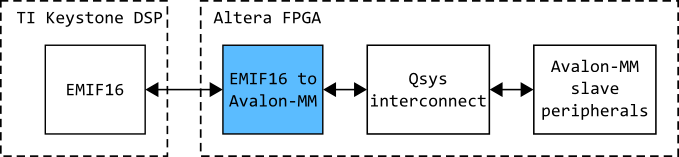

### Модуль преобразования интерфейса EMIF16 в интерфейс Avalon-MM Master

Данный модуль преобразует зыпросы процессора по интерфейсу EMIF16 в запросы по интерфейсу Avalon-MM. Это позволяет интегрировать процессор TI Keystone в Qsys-систему и использовать стандартный интерфейс для подключения различных периферийных компонентов, в том числе готовых модулей из библиотеки Qsys. При этом, регистры периферийных модулей просто отображаются в адресное пространство процессора соответствующее EMIF16.

### Принцип работы

Для мастера Avalon-MM необходимым является сигнал waitrequest. Данный модуль согласует сигнал waitrequest интерфейса Avalon-MM и сигнал WAIT интерфейса EMIF16:

* По умолчанию сигнал EMIF16 WAIT активен
* По началу транзакции EMIF16 (начало строба CEn) удерживаем сигнал WAIT еще заданное количество тактов (задается параметром HOLD_CYCLES). Так как сигнал CEn привязывается к внутренней частоте FPGA и синхронизируется, то в итоге WAIT дополнительно удерживается активным на SYNC_STAGES + HOLD_CYCLES тактов частоты FPGA. Согласно документации от TI нужно удерживать WAIT после начала строба минимум в течение 2E, E - один период частоты работы EMIF16. Поэтому значение параметра HOLD_CYCLES следует выбирать в зависимости от соотношения частот EMIF16 и FPGA.
* Пока выполняем запрос по Avalon-MM сигнал WAIT EMIF16 продолжаем удерживать активным
* Снимаем WAIT после завершения транзакции по Avalon-MM, которое отслеживаем по сигналу waitrequest
* По завершении транзакции EMIF16 (конец строба CEn) снова переводим WAIT в активное состояние